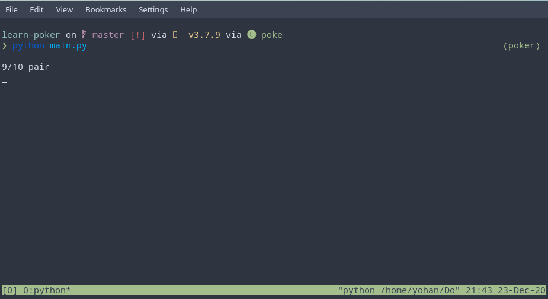

# Terminal Poker

A command-line program created to help with learning poker hands - easily extensible for learning or emulating many other card games.

## Dependencies

- python > 3.5
- [ueberzug](https://github.com/seebye/ueberzug)
- [more-itertools](https://pypi.org/project/more-itertools/)

## Run

```bash
python main.py
```

Expect a top row of house cards and a couple of player cards below. Press any key to reveal what the hand is i.e. flush, straight etc, and the hand strength - 1 is the best hand you can get (royal flush) and 10 is the worst (high card). Press any key again to load another round.

## Screenshots



